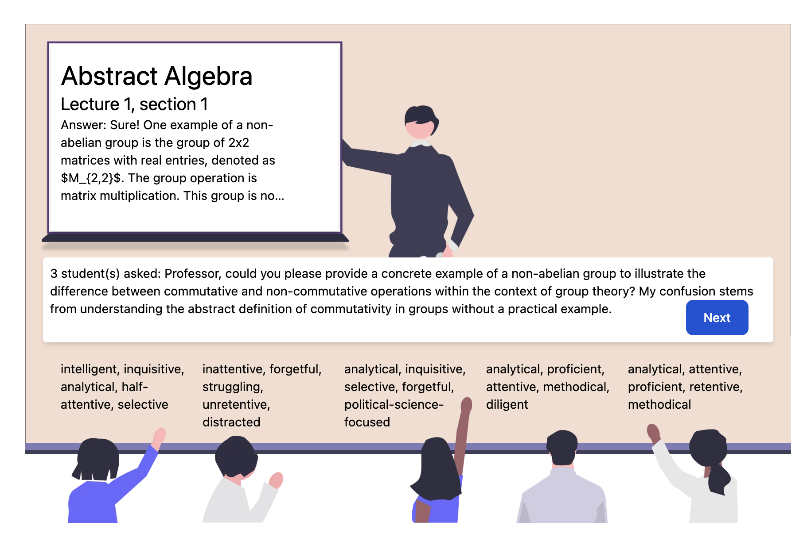

# MinervAI

Empowering teachers through interactions with realistic simulated classrooms. MinervAI combines AI agent students with various backgrounds and proficiencies to help educators better understand students and the ways in which they think.

In this beta version of MinervAI,  language models serve as AI agents in the classroom: each is initialized with a distinct personality (ex: “confident”), background (ex: “liberal arts student with math training”) and weight factor (which varies the scale of the 2 prior features’ impact) which influences their understanding of topics.

Users can upload a “lecture file” containing important information. The text is interpreted by the professor agent, which lectures the students, who then internalize the new data and generate new questions depending on their background. The professor then provides sample answers specific to each student’s needs and knowledge gaps.

The final output of this tool is a summary file listing Q+A conversations and summary statistics regarding question types (commonly asked questions, question frequency, recurring “keyword” concepts and more).

<h2>Requirements for running</h2>

The required packages needed to run MinervAI are included in the ***requirements.txt*** file.

The semantic kernel package can be installed using the command `python3 -m pip install semantic-kernel`.

Other packages can be installed using `pip3 install ...` command. 

## MinervAI - Team Contributions

MinervAI is an innovative educational tool designed to empower teachers through interactions with AI-simulated classrooms. This project was developed as part of the HackUMass XI Hackathon, where it was awarded the Grand Overall Prize.

We would like to firstly thank Taichi Kato (one of our pivotal founding members) for giving an awesome introduction to Semantic Kernels, and making pivotal contributions to the project with us!!

### Team Members & Contributions

#### Dhyey Mavani
- **Role:** Backend Development & Project Management
- **Contributions:**
  - Initiated the backend agents OOP framework.
  - Implemented various functions within the backend with prompt engineering.
  - Managed the development on the GitHub repository.
  - Played a key role in the initial system design and conceptualization of the project.
  - Drew Insights from previous projects such as LogFlowAI (Backed by Y Combinator), and MammothEdu from HackMIT

#### Muhammad Ahsan Tahir
- **Role:** Backend Development
- **Contributions:**
  - Focused on back-end development, particularly on the question similarity detector and output JSON.
  - Developed all agent classes including prompt engineering.
  - Worked on making function calls concurrent to speed up run time.

#### Sawyer Pollard
- **Role:** Frontend Development
- **Contributions:**
  - Co-developed the frontend using React and TailwindCSS.
  - Assisted in architecting the backend and frontend connection.
  - Designed a robust web file upload system with rich user feedback.

#### Sebastien Brown
- **Role:** Frontend and Backend Integration
- **Contributions:**
  - Worked on front-end design and styling.
  - Tuned and tested backend APIs.
  - Assisted in initial system design and development of the pitch concept and deck.
  - Drew Insights from previous projects such as LogFlowAI (Backed by Y Combinator), and MammothEdu from HackMIT

#### TinaZS Zhang
- **Role:** Frontend Design & Pitch
- **Contributions:**
  - Created wireframes and graphics for the project.
  - Involved in prompt engineering and development of the pitch deck.

#### Taichi Kato
- **Role:** Full Stack Development
- **Contributions:**
  - Contributed to both frontend and backend development.
  - Played a pivotal role in integrating semantic kernels into the project.
  - Assisted in the initial idea generation and system design.

